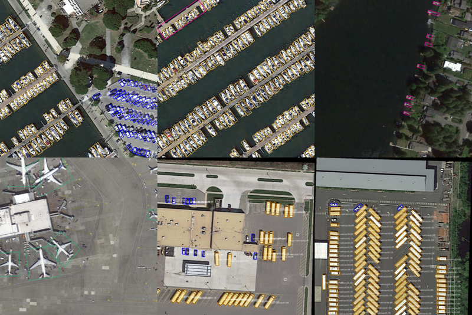

**YOLOX OBB -- YOLOX 旋转框**


***

***

## **ForeWord**
  More rotated detection methods can reference [OBBDetection](https://github.com/jbwang1997/OBBDetection.git). 
## **Introduction**

### Method
  OBB -> PolyIoU Loss \ KLD Loss \ GWD Loss

## **Content**

- [Quick&nbsp;Start](#Quick&nbsp;Start)
- [Instruction](#Instruction)
  - [Data](#Data)
  - [Demo](#Demo)
  - [Train](#Train)
  - [Test](#Test)

- [Ralated&nbsp;Hub](#Ralated&nbsp;Hub)

## **Quick&nbsp;Start**

Firstly, create python environment

```shell
conda create -n yolox_obb python=3.7 -y
```
then, install pytorch according to your machine, as cuda-10.2 and pytorch-1.7.0, you can install like following
```shell
conda activate yolox_obb
conda install pytorch==1.7.0 torchvision==0.8.0 torchaudio==0.7.0 cudatoolkit=10.2 -c pytorch -y
```
then, clone the github of the item and install requirements

```shell
git clone --recursive https://github.com/DDGRCF/YOLOX_OBB.git
cd YOLOX_OBB
pip3 install -U pip && pip3 install -r requirements.txt
pip3 install -v -e .
```
install BboxToolkit
```shell
cd BboxToolkit
python setup.py develop
```
## **Instruction**
### **Data**
#### **Convert Other data format into dota style**
If We want to train your datasets, firstly you first convert your data as dota datasets format. If you have a coco annotation-style datasets, you can just convert it annoatations into dota format. We perpare a script for you.
```shell
$ cd my_exps
$ bash coco2dota.sh
# PS: you should change filename、diranme and so on.
```
#### **Convert dota style into  BboxToolkit style**
This part please reference [BboxToolkit](./BboxToolkit/USAGE.md)


### **Demo**
I prepare the shell the demo script so that you can quick run obb demo as :
```shell
$ cd my_exps
$ bash demo_dota_obb.sh [data_type] 0 /path/to/you
# PS: 0 is to assign the train environment to 0 gpu, you can change it by youself and /path/to/you is your demo images. data_type can be selected in [dota1_0, dota2_0]
```
 
### **Train**
```shell
$ cd my_exps
$ bash train_dota_obb.sh data_type 0
```
### **Test**
Test contains eval online and generate submission file, they are all convenient.
* for eval online
```shell
$ cd my_exps
$ ./eval_dota_obb.sh [data_type] eval 0
# PS: for convenience, I set default parameters. So, eval means evaluating DOTA val datasets.
```
* for generate submission file
```shell
$ cd my_exps
$ ./eval_dota_obb.sh [data_type] test 0
```
## **Results**
|Model | image size | mAP | epochs |
| ------        |:---:  |  :---: |  :---: |
|[YOLOX_s_dota1_0](./exps/example/yolox_obb/yolox_s_dota1_0.py) |1024  | 70.82 | 80 |
|[YOLOX_s_dota2_0](./exps/example/yolox_obb/yolox_s_dota2_0.py) |1024  | 49.52 | 80 |
## **Ralated&nbsp;Hub**

- [YOLOX](https://github.com/Megvii-BaseDetection/YOLOX.git)

- [OBBDetection](https://github.com/jbwang1997/OBBDetection.git)

- [BboxToolkit](https://github.com/jbwang1997/BboxToolkit.git)
